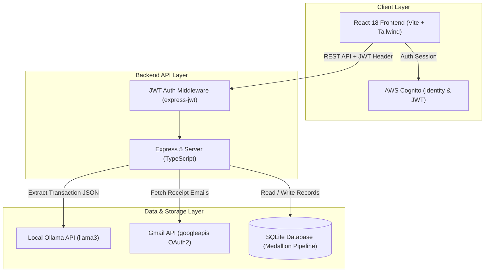
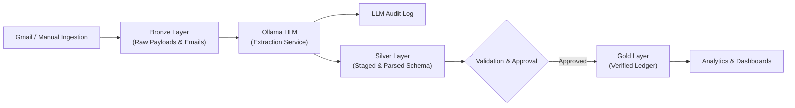
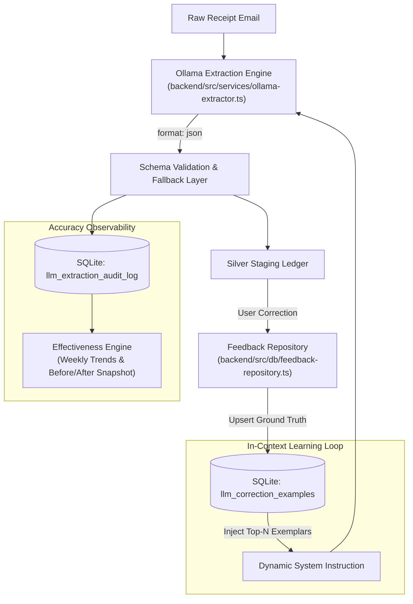
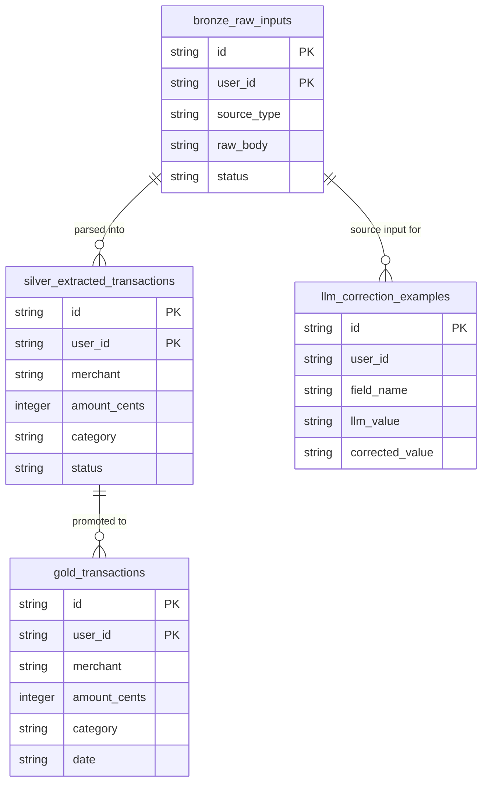

# Daily Expense

A full-stack daily expense tracking application built with Node.js, Express, React, and SQLite. It implements a Medallion Data Architecture (Bronze, Silver, Gold layers) to process financial transaction emails via local LLM parsing (Ollama) and provides financial analytics and budget insights.

---

## Features

- **Medallion Data Pipeline**:
  - **Bronze Layer**: Raw storage for ingested financial emails and raw payloads (`bronze_raw_inputs`).
  - **Silver Layer**: Staging layer for structured extraction, data cleaning, and user verification (`silver_extracted_transactions`).
  - **Gold Layer**: Cleaned, verified transaction ledger ready for analytics and reporting (`gold_transactions`).
- **Automated Transaction Ingestion**: Fetch financial receipt emails via Gmail OAuth2 integration.
- **LLM-Powered Parsing**: Extract transaction date, amount, merchant, category, and payment method using local LLM models (Ollama `llama3`) with audit logging.
- **In-Context Few-Shot Learning**: Remembers user field corrections (`llm_correction_examples`) and dynamically injects them into future prompts to improve extraction accuracy over time.
- **Financial Analytics & Dashboard**: Visual spending calendar, billing cycle comparison trends, category breakdowns, and customizable calibration settings.
- **Raw Database Inspector**: Built-in browser tool to inspect raw SQLite schemas, Bronze/Silver/Gold tables, and LLM extraction audit logs.
- **Multi-Tenant User Isolation**: Endpoint authentication via AWS Cognito JWT tokens (`express-jwt` + `jwks-rsa`) ensuring strict data isolation per user.
- **Centralized Logging**: Asynchronous logging powered by `pino` (backend) and `loglevel` (frontend) with local log viewers (`pino-pretty`).

---

## Architecture Overview



### Medallion Data Pipeline Flow



---

## LLM Ingestion & Prompting Architecture

The application uses local LLM inference (Ollama with `llama3`, configurable via `LLM_MODEL` in `backend/.env`) to convert unstructured financial email receipts into validated ledger transactions. The ingestion pipeline combines constrained JSON parsing, database-backed few-shot learning, and real-time accuracy observability.



### System Design & Implementation Details

1. **Constrained Structured Output Parsing**:
   - **Deterministic JSON Decoding**: Uses Ollama's native JSON mode (`format: 'json'`) bound to an 8-field schema contract (`merchant`, `amount`, `currency`, `date`, `category`, `paymentMethod`, `transactionType`).
   - **Joint Entity Extraction**: Prompts the LLM to scan full email text to combine financial institutions (HDFC, ICICI, SBI) and payment rails (UPI, Credit Card, NEFT) into unified payment method descriptors (e.g., `"HDFC Credit Card"`).
   - **11-Category Taxonomy**: Enforces categorical classification across standardized domains (`Groceries`, `Utilities`, `Cabs & Transport`, `Online Food Order`, `Cloud & Software Services`, etc.).

2. **Closed-Loop In-Context Learning (Few-Shot Prompting)**:
   - **Ground-Truth Correction Storage**: When a user corrects a parsed field, the ground-truth edit is saved in SQLite (`llm_correction_examples`).
   - **Dynamic Context Injection**: Prior to sending chat requests, recent historical correction examples are dynamically prepended to the system prompt (`contextBlock`), allowing the model to adapt to user preferences without fine-tuning.
   - **Automated Deduplication**: Updates for existing input/field pairs overwrite previous entries to maintain accurate prompt context.

3. **Defensive Processing & Fallbacks**:
   - **Type Validation & Normalization**: The extraction service ([`backend/src/services/ollama-extractor.ts`](backend/src/services/ollama-extractor.ts)) applies runtime type coercion (`typeof amount === 'number'`), ISO currency normalization, and default fallback assignments (`"Unknown Merchant"`, `"Other"`, current date) to ensure malformed LLM responses never throw unhandled exceptions.

4. **System Observability & Accuracy Tracking**:
   - **Audit Logging**: Every extraction task records raw prompts, LLM responses, execution latency, and token metrics in `llm_extraction_audit_log`.
   - **Accuracy Metrics**: The feedback module ([`backend/src/db/feedback-repository.ts`](backend/src/db/feedback-repository.ts)) calculates:
     - **Before vs. After Impact**: Compares baseline extraction accuracy against post-correction performance to evaluate few-shot learning impact.
     - **Weekly Accuracy Trends**: Tracks precision across attributes (`merchant`, `category`, `paymentMethod`) across calendar weeks.

---

## Database Architecture & Medallion Storage

The application implements a multi-stage **Medallion Architecture** using SQLite (`data/daily_expense.db`). Detailed schema definitions are documented in [`DATABASE.md`](DATABASE.md).



### Storage Principles & Security Standards

- **Medallion Data Pipeline**:
  - **Bronze (`bronze_raw_inputs`)**: Raw email payload sink preserving immutable source content and metadata.
  - **Silver (`silver_extracted_transactions`)**: Intermediate staging layer holding LLM-extracted fields pending user validation.
  - **Gold (`gold_transactions`)**: Verified double-entry ledger used for financial analytics, trend graphs, and reporting.
- **Integer Cents Financial Precision**: To avoid IEEE 754 floating-point rounding inaccuracies, all currency values are converted to and stored as integer cents (e.g., `$10.50` is stored as `1050`).
- **Multi-Tenant User Isolation Standard**: Every table partitions records by `user_id` parsed from AWS Cognito JWT sub claims (`req.auth.sub`). Every database query enforces strict `user_id` filtering to guarantee multi-tenant data privacy.
- **Audit & Feedback Persist Layer**:
  - `llm_extraction_audit_log`: Persists execution latency, raw prompt payload, model response, and extraction status.
  - `llm_correction_examples`: Ground-truth feedback store powering dynamic few-shot prompt context injection.
  - `feedback_settings`: Configuration store for enabling/disabling few-shot feedback and setting maximum example limits.

---

## Requirement Traceability & Software Quality Standards

To prevent knowledge decay and technical debt common in legacy software projects, this codebase enforces strict **Bidirectional Requirement Traceability**. Detailed documentation is available in [`REQUIREMENTS_TRACEABILITY.md`](REQUIREMENTS_TRACEABILITY.md).

- **Requirement-to-Test Mapping**: Every functional requirement ([`FUNCTIONAL_DOCUMENTATION.md`](FUNCTIONAL_DOCUMENTATION.md)), non-functional requirement ([`NON_FUNCTIONAL_REQUIREMENTS.md`](NON_FUNCTIONAL_REQUIREMENTS.md)), and bug entry ([`BUG_REGISTRY.md`](BUG_REGISTRY.md)) is tagged with a unique ID (`[FUNC-*]`, `[NFR-*]`, `[BUG-*]`).
- **Test Justification Annotations**: Every unit and integration test suite in Jest and Vitest explicitly declares the requirement or bug ID it validates.
- **Automated RTM Matrix (`rtm_report.html`)**: Running `npm run rtm` executes an automated scanner ([`tools/rtm/generate-rtm.js`](tools/rtm/generate-rtm.js)) that verifies 100% test coverage across all requirements and produces an interactive visual report.

---

## Tech Stack

| Domain | Stack / Libraries |
| :--- | :--- |
| **Frontend** | React 18, TypeScript, Vite, Tailwind CSS v4, AWS Amplify UI (Cognito Auth), `loglevel` |
| **Backend** | Node.js, Express 5, TypeScript, SQLite3, `express-jwt`, `jwks-rsa`, `googleapis`, `pino` |
| **LLM Integration** | Ollama (Local HTTP API with `llama3`) |
| **Testing** | Jest, `supertest`, Vitest, React Testing Library |
| **Development Tools** | `ts-node-dev`, `pino-pretty` |

---

## Getting Started

### Prerequisites

- **Node.js**: v18.x or higher
- **npm**: v9.x or higher
- **Ollama**: Required for local LLM transaction extraction (`ollama run llama3`)
- **AWS Cognito**: User Pool configured for frontend authentication and backend JWT verification

---

## Configuration

1. **Backend Environment**:
   Copy `.env.example` in `backend/` to `.env` and fill in your configuration:

   ```bash
   cp backend/.env.example backend/.env
   ```

   Key configuration variables in `backend/.env`:
   ```ini
   PORT=3001
   COGNITO_USER_POOL_ID=your_user_pool_id
   COGNITO_CLIENT_ID=your_client_id
   COGNITO_REGION=your_region
   DATABASE_URL=./data/daily_expense.db
   LLM_PROVIDER=ollama
   LLM_MODEL=llama3
   LLM_ENDPOINT=http://localhost:11434
   LOG_LEVEL=info
   LOG_FILE_PATH=logs/app.log
   ```

2. **Frontend Environment**:
   Copy `.env.example` in `frontend/` to `.env`:

   ```bash
   cp frontend/.env.example frontend/.env
   ```

   Key configuration variables in `frontend/.env`:
   ```ini
   VITE_COGNITO_USER_POOL_ID=your_user_pool_id
   VITE_COGNITO_CLIENT_ID=your_client_id
   VITE_COGNITO_REGION=your_region
   VITE_LOG_LEVEL=warn
   VITE_ENABLE_LOG_FORWARDING=false
   ```

---

## Installation & Setup

1. **Install Dependencies**:

   Backend:
   ```bash
   cd backend
   npm install
   ```

   Frontend:
   ```bash
   cd frontend
   npm install
   ```

2. **Start the Local LLM (Ollama)**:
   ```bash
   ollama run llama3
   ```

3. **Start the Backend Server**:
   ```bash
   cd backend
   npm run dev
   ```
   *Backend runs on `http://localhost:3001`.*

4. **Start the Frontend Application**:
   ```bash
   cd frontend
   npm run dev
   ```
   *Frontend runs on `http://localhost:5173`.*

---

## Project Structure

```
daily_expense/
├── backend/
│   ├── data/                 # SQLite database storage
│   ├── logs/                 # Pino application log files
│   ├── src/
│   │   ├── db/               # SQLite repositories & Medallion pipeline logic
│   │   ├── middleware/       # JWT Auth & error handling middlewares
│   │   ├── routes/           # API endpoints (ingestion, pipeline, gold transactions)
│   │   ├── services/         # Gmail API & LLM integration services
│   │   └── server.ts         # Express entrypoint
│   └── tests/                # Backend unit & integration test suites
├── frontend/
│   ├── src/
│   │   ├── components/       # UI components & charts
│   │   ├── pages/            # Routes (Dashboard, Ingestion, Pipeline, Ledger, Analytics)
│   │   ├── services/         # API HTTP client functions
│   │   └── utils/            # Helper utilities
│   └── vitest.config.ts      # Vitest configuration
├── tools/                    # Administrative CLI maintenance scripts
├── FUNCTIONAL_DOCUMENTATION.md
├── NON_FUNCTIONAL_REQUIREMENTS.md
├── REQUIREMENTS_TRACEABILITY.md
├── DATABASE.md
├── BUG_REGISTRY.md
└── package.json
```

---

## Development & Utility Scripts

### Running Tests

- **Backend Tests (Jest)**:
  ```bash
  cd backend
  npm test
  ```

- **Frontend Tests (Vitest)**:
  ```bash
  cd frontend
  npm test
  ```

### Log Viewing

Pretty print backend logs using `pino-pretty`:
```bash
cd backend
npm run view-logs
# Or live tail:
npm run tail-logs
```

### Administrative Tools

- **Generate Requirement Traceability Matrix (RTM) Report**:
  ```bash
  npm run rtm
  ```
- **Clear Database**:
  ```bash
  npm run clear-db
  ```

---

## License

[ISC](LICENSE)
