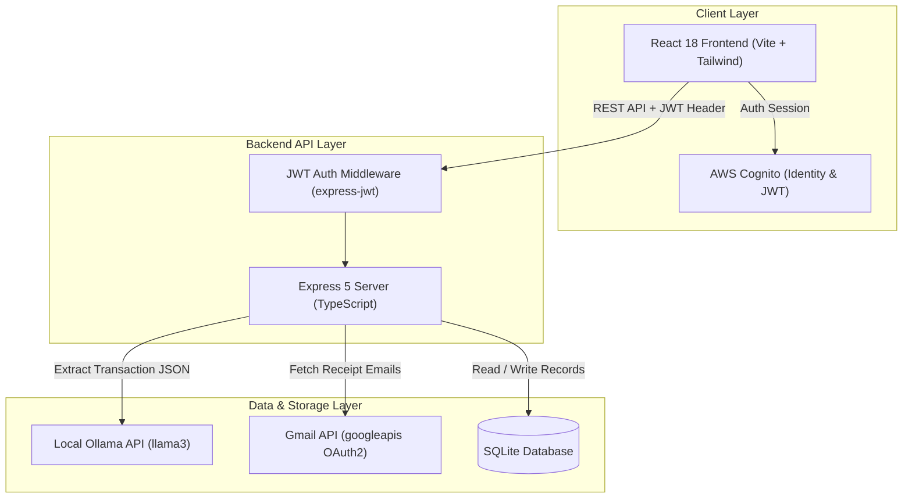
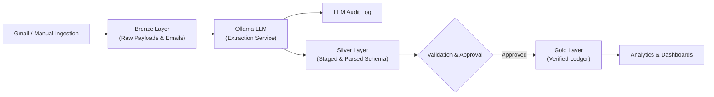
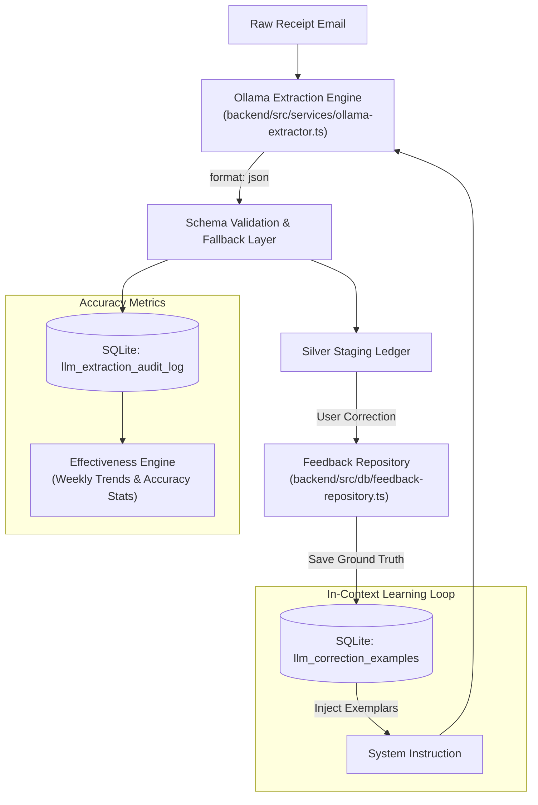
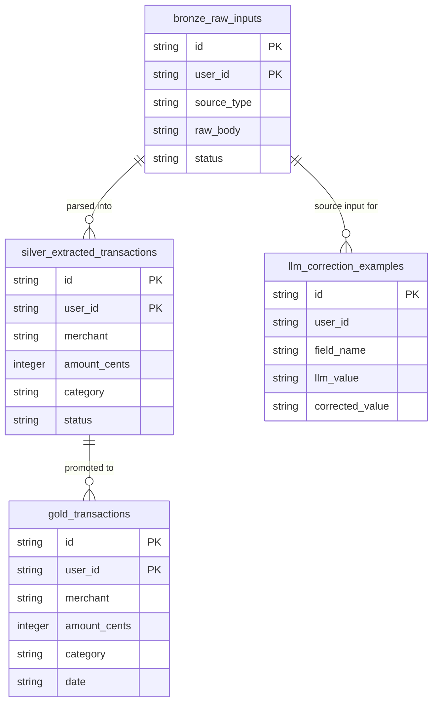

# Daily Expense

A full-stack daily expense tracker built with Node.js, Express, React, and SQLite. It processes receipt emails through a Medallion data architecture (Bronze, Silver, Gold), parses transaction details using a local LLM (Ollama), and provides spending analytics and budget insights.

---

## Features

- **Medallion Data Pipeline**:
  - **Bronze Layer (`bronze_raw_inputs`)**: Raw storage for ingested financial emails and payload dumps.
  - **Silver Layer (`silver_extracted_transactions`)**: Staging layer for structured extraction, data cleaning, and user verification.
  - **Gold Layer (`gold_transactions`)**: Cleaned, verified ledger used for financial analytics and reporting.
- **Automated Email Ingestion**: Fetches financial receipt emails via Gmail OAuth2 integration.
- **Local LLM Parsing**: Extracts transaction date, amount, merchant, category, and payment method using Ollama (`llama3`).
- **Few-Shot Learning**: Stores user field edits (`llm_correction_examples`) and includes them in prompt contexts to improve extraction accuracy over time.
- **Financial Dashboard**: Visual spending calendar, billing cycle comparison trends, category breakdowns, and calibration settings.
- **Database Inspector**: In-app browser tool to inspect raw SQLite schemas, Bronze/Silver/Gold tables, and LLM extraction audit logs.
- **User Isolation**: Authenticates endpoints using AWS Cognito JWT tokens (`express-jwt` + `jwks-rsa`) to isolate user data.
- **Logging**: Structured logging using `pino` (backend) and `loglevel` (frontend), readable via `pino-pretty`.

---

## Architecture Overview



### Medallion Data Pipeline Flow



---

## LLM Transaction Processing

The extraction engine ([`backend/src/services/ollama-extractor.ts`](backend/src/services/ollama-extractor.ts)) uses Ollama (`llama3`, configured via `LLM_MODEL` in `backend/.env`) to parse unstructured receipt emails into JSON records.



### Implementation Details

1. **Structured JSON Output**: Uses Ollama's `format: 'json'` with an 8-field schema (`merchant`, `amount`, `currency`, `date`, `category`, `paymentMethod`, `transactionType`).
2. **Entity Combination**: Combines bank names (HDFC, ICICI, SBI) and payment types (UPI, Credit Card, NEFT) into unified labels (e.g. `"HDFC Credit Card"`).
3. **Few-Shot Feedback**: Saves user corrections in `llm_correction_examples` and prepends recent exemplars to the prompt context.
4. **Validation & Fallbacks**: Normalizes amounts to numbers, forces 3-letter ISO currency codes, and assigns defaults (`"Unknown Merchant"`, `"Other"`) if fields are missing.
5. **Audit Logging**: Logs raw prompts, model responses, latency, and token metrics in `llm_extraction_audit_log`.

---

## Database Schema & Medallion Storage

Data evolution is managed through SQLite (`data/daily_expense.db`). Complete schema details are available in [`DATABASE.md`](DATABASE.md).



### Key Storage Rules

- **Medallion Pipeline**:
  - **Bronze (`bronze_raw_inputs`)**: Raw email payload sink.
  - **Silver (`silver_extracted_transactions`)**: Staging layer for extracted fields pending review.
  - **Gold (`gold_transactions`)**: Confirmed transaction ledger for analytics.
- **Integer Cents**: All monetary values are stored in cents (e.g. `$10.50` is stored as `1050`) to avoid floating-point rounding errors.
- **User Isolation**: Tables partition data by `user_id` parsed from AWS Cognito JWT sub claims (`req.auth.sub`).

---

## Requirements-Driven Development

This project uses a test-first workflow to ensure that code changes are directly tied to documented requirements and bug logs:

- **Requirement Traceability**: Requirements ([`FUNCTIONAL_DOCUMENTATION.md`](FUNCTIONAL_DOCUMENTATION.md) and [`NON_FUNCTIONAL_REQUIREMENTS.md`](NON_FUNCTIONAL_REQUIREMENTS.md)) and defect reports ([`BUG_REGISTRY.md`](BUG_REGISTRY.md)) are assigned unique IDs (`[FUNC-*]`, `[NFR-*]`, `[BUG-*]`).
- **Test Mapping**: Unit and integration tests annotate the specific ID they validate before code implementation begins.
- **Traceability Report**: Running `npm run rtm` scans the codebase and generates an updated [`rtm_report.html`](rtm_report.html) showing requirement coverage across all test suites.

For a full breakdown of the methodology and technical debt prevention strategy, see [`REQUIREMENTS_DRIVEN_DEVELOPMENT.md`](REQUIREMENTS_DRIVEN_DEVELOPMENT.md).

---

## Tech Stack

| Domain | Stack / Libraries |
| :--- | :--- |
| **Frontend** | React 18, TypeScript, Vite, Tailwind CSS v4, AWS Amplify UI (Cognito Auth), `loglevel` |
| **Backend** | Node.js, Express 5, TypeScript, SQLite3, `express-jwt`, `jwks-rsa`, `googleapis`, `pino` |
| **LLM Integration** | Ollama (Local HTTP API with `llama3`) |
| **Testing** | Jest, `supertest`, Vitest, React Testing Library |
| **Development Tools** | `ts-node-dev`, `pino-pretty` |

---

## Getting Started

### Prerequisites

- **Node.js**: v18.x or higher
- **npm**: v9.x or higher
- **Ollama**: Running locally with `llama3` (`ollama run llama3`)
- **AWS Cognito**: User Pool set up for authentication

---

## Configuration

1. **Backend Setup**:
   ```bash
   cp backend/.env.example backend/.env
   ```
   Key variables in `backend/.env`:
   ```ini
   PORT=3001
   COGNITO_USER_POOL_ID=your_user_pool_id
   COGNITO_CLIENT_ID=your_client_id
   COGNITO_REGION=your_region
   DATABASE_URL=./data/daily_expense.db
   LLM_PROVIDER=ollama
   LLM_MODEL=llama3
   LLM_ENDPOINT=http://localhost:11434
   LOG_LEVEL=info
   LOG_FILE_PATH=logs/app.log
   ```

2. **Frontend Setup**:
   ```bash
   cp frontend/.env.example frontend/.env
   ```
   Key variables in `frontend/.env`:
   ```ini
   VITE_COGNITO_USER_POOL_ID=your_user_pool_id
   VITE_COGNITO_CLIENT_ID=your_client_id
   VITE_COGNITO_REGION=your_region
   VITE_LOG_LEVEL=warn
   VITE_ENABLE_LOG_FORWARDING=false
   ```

---

## Installation & Running

1. **Install Dependencies**:
   ```bash
   cd backend && npm install
   cd ../frontend && npm install
   ```

2. **Start Ollama**:
   ```bash
   ollama run llama3
   ```

3. **Start Backend**:
   ```bash
   cd backend && npm run dev
   ```
   Runs on `http://localhost:3001`.

4. **Start Frontend**:
   ```bash
   cd frontend && npm run dev
   ```
   Runs on `http://localhost:5173`.

---

## Project Structure

```
daily_expense/
├── backend/
│   ├── data/                 # SQLite database files
│   ├── logs/                 # Log files
│   ├── src/
│   │   ├── db/               # SQLite repositories & Medallion pipeline logic
│   │   ├── middleware/       # Auth & error handling middlewares
│   │   ├── routes/           # REST API routes
│   │   ├── services/         # Gmail API & LLM integration
│   │   └── server.ts         # Express server entrypoint
│   └── tests/                # Jest unit & integration tests
├── frontend/
│   ├── src/
│   │   ├── components/       # React components
│   │   ├── pages/            # Page views
│   │   ├── services/         # API HTTP client
│   │   └── utils/            # Utilities
│   └── vitest.config.ts      # Vitest config
├── tools/                    # CLI maintenance scripts
├── FUNCTIONAL_DOCUMENTATION.md
├── NON_FUNCTIONAL_REQUIREMENTS.md
├── REQUIREMENTS_DRIVEN_DEVELOPMENT.md
├── DATABASE.md
├── BUG_REGISTRY.md
└── package.json
```

---

## Development Scripts

### Run Tests

- **Backend**: `cd backend && npm test`
- **Frontend**: `cd frontend && npm test`

### View Logs

- **Pretty Print**: `cd backend && npm run view-logs`
- **Tail Logs**: `cd backend && npm run tail-logs`

### Administrative Utilities

- **Generate RTM Report**: `npm run rtm`
- **Clear Database**: `npm run clear-db`

---

## License

[ISC](LICENSE)
