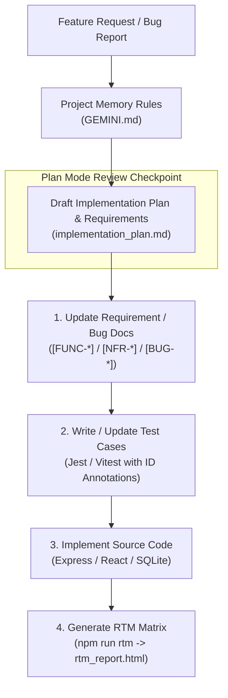

# Requirements-Driven Development & Project Memory Architecture

This document outlines how project memory rules and requirement traceability are used in this codebase to prevent technical debt, protect system context, and keep test suites aligned with business requirements.

---

## Technical Debt in Legacy Codebases

Fast feature delivery often leaves behind unmapped code and missing test coverage. As engineering teams evolve, two main issues emerge:

1. **Context Loss During Turnover**: When engineers leave, system context leaves with them. Issue trackers (Jira, Azure DevOps) rarely capture full architectural trade-offs, forcing new team members to reverse-engineer legacy code.
2. **Unlinked Tests & Manual Testing**: Tests that are missing or unlinked from business requirements force teams to rely on manual QA. This makes releases slow and increases the risk of regressions.

To address this, documentation, automated tests, and application code must evolve together.

---

## Development Workflow: Greenfield vs. Bug Fixes

All code modifications in this repository follow a test-first workflow:

```
[Requirement ID] ──> [Automated Test Case] ──> [Code Implementation] ──> [Automated RTM Matrix]
```

### 1. New Features (Greenfield)
Before writing feature code:
- **Define the Requirement**: Add functional (`[FUNC-XXXX]`) and non-functional (`[NFR-XXXX]`) requirements to [`FUNCTIONAL_DOCUMENTATION.md`](FUNCTIONAL_DOCUMENTATION.md) and [`NON_FUNCTIONAL_REQUIREMENTS.md`](NON_FUNCTIONAL_REQUIREMENTS.md).
- **Write the Test First**: Create automated tests in Jest (`backend/tests/`) or Vitest (`frontend/src/`) annotated with the target ID (e.g., `[FUNC-GMAIL-37]`).
- **Implement the Code**: Write production code solely to satisfy those pre-written test assertions.

### 2. Bug Fixes & Edge Cases (Legacy Remediation)
When fixing reported issues:
- **Log the Defect**: Register the issue in [`BUG_REGISTRY.md`](BUG_REGISTRY.md) with a `[BUG-XXXX]` ID.
- **Write a Regression Test**: Create an automated test targeting `[BUG-XXXX]` to reproduce the failure.
- **Fix the Bug**: Update production code until the test passes, permanently linking the fix to the defect registry.

---

## Project Memory & Plan Mode Rules

To enforce these standards consistently, project rules in [`GEMINI.md`](GEMINI.md) define the execution sequence for the AI assistant:



### 1. Project Memory Rules (`GEMINI.md`)
Repository rules ([`GEMINI.md`](GEMINI.md)) mandate the following constraints:
- **Plan Mode First**: Formulate an implementation plan and update requirement/bug documentation before editing source code.
- **User-Centric Language**: Write functional requirements describing what the user does or sees (e.g., *"The user must see..."*).
- **Test-Backed Code**: Executable code is only written to satisfy an annotated test case.

### 2. Plan Checkpoint
Before modifying files, **Plan Mode** outputs an execution plan showing:
- Affected Requirement and Bug IDs.
- Test files to be created or updated first.
- Production code changes that will follow.

---

## Implementation Examples in the Codebase

### 1. Requirement Definition ([`FUNCTIONAL_DOCUMENTATION.md`](FUNCTIONAL_DOCUMENTATION.md))

```markdown
## [FUNC-GMAIL-37] Bronze Pipeline Statuses: processed, unprocessed, rejected
The user must see status indicators on raw receipt items reflecting their ingestion state and be able to reject items cleanly.
```

### 2. Test Annotation ([`backend/tests/transaction-pipeline.test.ts`](backend/tests/transaction-pipeline.test.ts))

```typescript
describe('Transaction Pipeline Service Integration', () => {
  /**
   * [FUNC-GMAIL-37] Bronze Pipeline Statuses
   * Verify that raw input items can be marked with rejected status.
   */
  it('should mark raw input as rejected in the repository', async () => {
    await repository.rejectRawInput('mock_id', 'test_user');
    const input = await repository.getRawInputById('mock_id', 'test_user');
    expect(input?.status).toBe('rejected');
  });
});
```

### 3. Automated RTM Generation ([`tools/rtm/generate-rtm.js`](tools/rtm/generate-rtm.js))

The RTM tool ([`tools/rtm/generate-rtm.js`](tools/rtm/generate-rtm.js)) scans documentation and test files to verify mapping:

```javascript
// Regex pattern matching requirement headers across docs and test annotations
const reqPattern = /^(?:-\s+|##\s+)\[((?:FUNC|NFR|BUG)-[A-Z0-9-]+)\]\s+(.*)/;
```

Run the generator:
```bash
npm run rtm
```

This updates [`rtm_report.html`](rtm_report.html), producing an interactive matrix showing:
- Total functional, non-functional, and bug requirement counts.
- Tested vs. untested requirement coverage metrics.
- Direct links between requirement IDs, test files, and line numbers.

---

## Comparison Summary

| Aspect | Traditional Legacy Approach | Requirements-Driven Model |
| :--- | :--- | :--- |
| **System Context** | Lost during team turnover. | Saved in [`FUNCTIONAL_DOCUMENTATION.md`](FUNCTIONAL_DOCUMENTATION.md) & [`GEMINI.md`](GEMINI.md). |
| **Requirements Location** | Buried in external issue trackers. | Version-controlled in repository markdown files. |
| **Test Case Mapping** | Tests mirror internal function names. | Tests explicitly annotate `[FUNC-*]`, `[NFR-*]`, or `[BUG-*]` IDs. |
| **Bug Fix Verification** | High risk of silent regressions. | [`BUG_REGISTRY.md`](BUG_REGISTRY.md) requires pre-fix regression tests. |
| **Audit & Verification** | Manual spreadsheets or static docs. | Automated HTML report via `npm run rtm` (`rtm_report.html`). |
