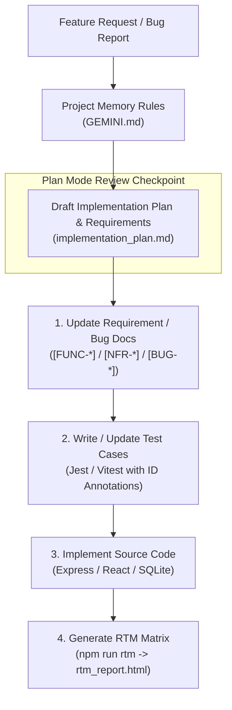

# Breaking the Cycle of Technical Debt: Requirements-Driven Development & Project Memory Architecture

This document describes how this repository uses **Project Memory Guardrails** and **Bidirectional Requirement Traceability** to prevent technical debt, protect institutional knowledge, and ensure every line of code maps directly to documented requirements and automated tests.

---

## The Blind Spot of Legacy Software

In fast-paced Agile teams, shipping features quickly is often prioritized over maintaining automated test suites and documentation. Over time, this creates two major risks:

1. **Vanishing Knowledge & Team Turnover**: When developers leave, system context leaves with them. Product backlogs (in Jira or Azure DevOps) rarely capture full architectural decisions—tickets contain user stories, but the deeper rationale lives only in the developer's head. New team members are forced to spend weeks reverse-engineering legacy code.
2. **Untracked Tests & Manual Testing Bottlenecks**: When automated tests are missing or unlinked from requirements, teams rely on manual QA. Manual testing requires deep system knowledge, making every release slow, expensive, and prone to regressions.

To break this cycle, documentation, automated test suites, and source code must be treated as a single, synchronized unit.

---

## Architectural Framework: Greenfield vs. Legacy Workflows

This codebase applies a strict requirements-driven engineering loop across all changes:

```
[Requirement ID] ──> [Automated Test Case] ──> [Code Implementation] ──> [Automated RTM Matrix]
```

### 1. New Feature Workflow (Greenfield)
Before writing any feature code:
- **Define the Requirement**: Document functional (`[FUNC-XXXX]`) and non-functional (`[NFR-XXXX]`) requirements in [`FUNCTIONAL_DOCUMENTATION.md`](FUNCTIONAL_DOCUMENTATION.md) and [`NON_FUNCTIONAL_REQUIREMENTS.md`](NON_FUNCTIONAL_REQUIREMENTS.md).
- **Write the Test First**: Create automated unit/integration tests (in Jest or Vitest) containing explicit requirement ID tags (e.g. `[FUNC-DB-VIEWER-2]`).
- **Implement the Code**: Write production code solely to satisfy those pre-written tests.

### 2. Defect & Bug Remediation Workflow (Legacy)
When fixing reported bugs or edge cases:
- **Log the Defect**: Record the issue in [`BUG_REGISTRY.md`](BUG_REGISTRY.md) with a unique ID (`[BUG-XXXX]`).
- **Write a Regression Test**: Create an automated test targeting `[BUG-XXXX]` to reproduce and lock in the expected behavior.
- **Fix the Bug**: Update production code until the test passes, permanently linking the fix to the defect registry.

---

## AI Project Memory & Plan Mode Checkpoints

To enforce these rules consistently, the repository configures the AI development agent via [`GEMINI.md`](GEMINI.md):



### 1. Project Memory Rules (`GEMINI.md`)
The repository instructions ([`GEMINI.md`](GEMINI.md)) define mandatory development steps that must be followed whenever code is modified:
- **Plan Mode First**: The agent must outline requirements, test strategies, and architectural changes before modifying source code.
- **User-Centric Writing**: Functional requirements must describe what the user experiences (e.g. *"The user must see..."*), avoiding internal implementation jargon.
- **No Unmapped Code**: Executable code is not accepted unless backed by an annotated test case.

### 2. Plan Mode Review Checkpoint
Before modifying any files, **Plan Mode** generates an execution proposal listing:
- Affected Requirement and Bug IDs.
- Test files to be created or updated first.
- Production code changes that will follow.

This checkpoint allows engineers to review the strategy before code is written.

---

## Implementation Examples in the Codebase

### 1. Requirement Definition ([`FUNCTIONAL_DOCUMENTATION.md`](FUNCTIONAL_DOCUMENTATION.md))

```markdown
## [FUNC-DB-VIEWER-2] Table Selection & Schema Inspection
The user must be able to inspect allowed database table schemas (gold_transactions, silver_extracted_transactions, bronze_raw_inputs, llm_extraction_audit_log) and view column metadata.
```

### 2. Test Annotation ([`backend/tests/db-viewer.test.ts`](backend/tests/db-viewer.test.ts))

```typescript
describe('Database Viewer Repository Integration', () => {
  /**
   * [FUNC-DB-VIEWER-2] Table Selection & Schema Inspection
   * Verify that the database viewer listing returns all allowed application tables and schema column information.
   */
  it('should return allowed database tables with metadata', async () => {
    const tables = await repository.getInspectableTables();
    expect(tables).toBeDefined();
    expect(Array.isArray(tables)).toBe(true);
    
    const tableNames = tables.map(t => t.name);
    expect(tableNames).toContain('gold_transactions');
    expect(tableNames).toContain('bronze_raw_inputs');
  });
});
```

### 3. Automated RTM Generation ([`tools/rtm/generate-rtm.js`](tools/rtm/generate-rtm.js))

The RTM tool ([`tools/rtm/generate-rtm.js`](tools/rtm/generate-rtm.js)) scans documentation and test files to verify mapping:

```javascript
// Regex pattern matching requirement headers across docs and test annotations
const reqPattern = /^(?:-\s+|##\s+)\[((?:FUNC|NFR|BUG)-[A-Z0-9-]+)\]\s+(.*)/;
```

Run the generator:
```bash
npm run rtm
```

This updates [`rtm_report.html`](rtm_report.html), producing an interactive matrix showing:
- Total functional, non-functional, and bug requirement counts.
- Tested vs. untested requirement coverage metrics.
- Direct links between requirement IDs, test files, and line numbers.

---

## Comparison Summary

| Metric | Traditional Legacy Workflow | Requirements-Driven AI Model |
| :--- | :--- | :--- |
| **System Context** | Lost when developers leave. | Saved in [`FUNCTIONAL_DOCUMENTATION.md`](FUNCTIONAL_DOCUMENTATION.md) & [`GEMINI.md`](GEMINI.md). |
| **Requirements Location** | Buried in backlog tickets. | Version-controlled in repository markdown files. |
| **Test Case Mapping** | Tests mirror internal function names. | Tests explicitly annotate `[FUNC-*]`, `[NFR-*]`, or `[BUG-*]` IDs. |
| **Bug Fix Verification** | High risk of silent regressions. | [`BUG_REGISTRY.md`](BUG_REGISTRY.md) requires pre-fix regression tests. |
| **Audit & Verification** | Manual spreadsheets or outdated docs. | Automated HTML report via `npm run rtm` (`rtm_report.html`). |
