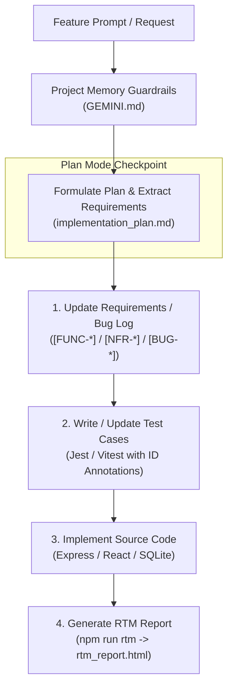

# Breaking the Cycle of Technical Debt: Requirements-Driven Development & Project Memory Architecture

This document describes how this repository uses **AI Project Memory Guardrails** and **Bidirectional Requirement Traceability** to prevent technical debt, eliminate knowledge loss, and ensure every line of code is strictly validated by automated tests mapped back to user requirements.

---

## The Core Problem: The Blind Spot of Legacy Software

In fast-paced software development, shipping features quickly often leads to technical debt. Over time, projects face two critical vulnerabilities:

1. **Vanishing Knowledge & Developer Turnover**: When engineers leave a team, institutional business context leaves with them. Backlog items (in Jira, Azure DevOps, or static issue trackers) rarely provide full architectural context. New team members face a steep uphill battle reverse-engineering *why* specific logic exists.
2. **Missing or Decoupled Automated Tests**: Without automated test cases tied directly to documented requirements, teams must rely on manual testing. Manual testing requires deep system knowledge—making releases risky, increasing regression threats, and creating massive engineering bottlenecks.

To break this cycle of technical debt, software development must ensure that **documentation, test suites, and source code evolve as an atomic, unified unit**.

---

## Architectural Framework: Greenfield vs. Legacy Workflows

This codebase applies a strict, requirements-driven engineering loop for both greenfield features and legacy remediation:

```
[Requirement ID] ──> [Automated Test Case] ──> [Code Implementation] ──> [Automated RTM Matrix]
```

### 1. Preventative Greenfield Workflow (New Features)
For all new feature requests and enhancements:
- **Define Requirement First**: Document functional (`[FUNC-XXXX]`) and non-functional (`[NFR-XXXX]`) requirements with unique IDs in [`FUNCTIONAL_DOCUMENTATION.md`](FUNCTIONAL_DOCUMENTATION.md) and [`NON_FUNCTIONAL_REQUIREMENTS.md`](NON_FUNCTIONAL_REQUIREMENTS.md).
- **Test-First Assertion**: Write automated unit/integration tests in Jest (`backend/tests/`) or Vitest (`frontend/src/`) containing explicit requirement ID annotations before touching production code.
- **TDD Implementation**: Write application code *solely* to satisfy those pre-written test assertions.

### 2. Defect Remediation Workflow (Legacy & Edge Cases)
When fixing reported bugs or edge-case defects:
- **Log the Defect**: Register the issue in [`BUG_REGISTRY.md`](BUG_REGISTRY.md) with a unique ID `[BUG-XXXX]`.
- **Write Regression Test**: Create an automated test mapped to `[BUG-XXXX]` to reproduce and prevent the issue.
- **Implement Fix**: Modify production code until the test passes, permanently linking the code change to the bug registry.

---

## AI Project Memory & Plan Mode Execution

This repository enforces these standards automatically using the **Antigravity AI Agent & Project Memory System** ([`GEMINI.md`](GEMINI.md)).



### 1. Deterministic Project Memory Guardrails (`GEMINI.md`)
The repository's AI environment configuration ([`GEMINI.md`](GEMINI.md)) acts as deterministic architectural guardrails. The AI assistant is strictly bound to execute the sequential workflow:
1. **Plan Mode First**: Analyze requirements, outline test strategies, and update documentation before editing source code.
2. **User-Centric Requirements Style**: Document functional requirements describing what the user experiences (e.g., *"The user must see..."*), avoiding purely internal technical noise.
3. **No Unmapped Code**: Ensure no executable code exists without a corresponding test, and no test exists without a requirement tag.

### 2. Plan Mode Review Checkpoint
Before modifying source code, the system enters **Plan Mode**, generating an execution plan detailing:
- Which Requirement/Bug IDs are affected.
- Which test files will be written/updated first.
- What production code changes will follow.

This gives the engineering team a vital review checkpoint to verify adherence to best practices before files are altered.

---

## Implementation Examples in the Codebase

### 1. Requirement Definition ([`FUNCTIONAL_DOCUMENTATION.md`](FUNCTIONAL_DOCUMENTATION.md))

```markdown
## [FUNC-DB-VIEWER-2] Table Selection & Schema Inspection
The user must be able to inspect allowed database table schemas (gold_transactions, silver_extracted_transactions, bronze_raw_inputs, llm_extraction_audit_log) and view column metadata.
```

### 2. Test-First Annotation ([`backend/tests/db-viewer.test.ts`](backend/tests/db-viewer.test.ts))

```typescript
describe('Database Viewer Repository Integration', () => {
  /**
   * [FUNC-DB-VIEWER-2] Table Selection & Schema Inspection
   * Verify that the database viewer listing returns all allowed application tables and schema column information.
   */
  it('should return allowed database tables with metadata', async () => {
    const tables = await repository.getInspectableTables();
    expect(tables).toBeDefined();
    expect(Array.isArray(tables)).toBe(true);
    
    const tableNames = tables.map(t => t.name);
    expect(tableNames).toContain('gold_transactions');
    expect(tableNames).toContain('bronze_raw_inputs');
  });
});
```

### 3. Automated Requirement Traceability Matrix ([`tools/rtm/generate-rtm.js`](tools/rtm/generate-rtm.js))

The RTM generator script ([`tools/rtm/generate-rtm.js`](tools/rtm/generate-rtm.js)) scans all documentation files and test suites via regex parsing:

```javascript
// Regex pattern matching requirement headers across documentation and test annotations
const reqPattern = /^(?:-\s+|##\s+)\[((?:FUNC|NFR|BUG)-[A-Z0-9-]+)\]\s+(.*)/;
```

Run the generator:
```bash
npm run rtm
```

This compiles [`rtm_report.html`](rtm_report.html), producing an interactive HTML matrix showing:
- Total functional, non-functional, and bug requirement counts.
- Tested vs. untested requirement coverage metrics.
- Direct links between requirement IDs, test suites, and line numbers.

---

## Summary Matrix

| Problem | Traditional Legacy Approach | Antigravity AI Project Memory Model |
| :--- | :--- | :--- |
| **Institutional Knowledge** | Lost when team members leave. | Retained in [`FUNCTIONAL_DOCUMENTATION.md`](FUNCTIONAL_DOCUMENTATION.md) & [`GEMINI.md`](GEMINI.md). |
| **Requirements Location** | Decayed in Jira/backlog tickets. | Version-controlled in repository markdown files. |
| **Test Case Mapping** | Tests mirror internal code units. | Tests explicitly annotate user-centric `[FUNC-*]`, `[NFR-*]`, or `[BUG-*]` IDs. |
| **Bug Fix Verification** | Silent risk of regression. | [`BUG_REGISTRY.md`](BUG_REGISTRY.md) enforces mandatory regression test tags. |
| **Verification Auditing** | Manual spreadsheets or outdated docs. | Automated dynamic HTML matrix via `npm run rtm` (`rtm_report.html`). |
